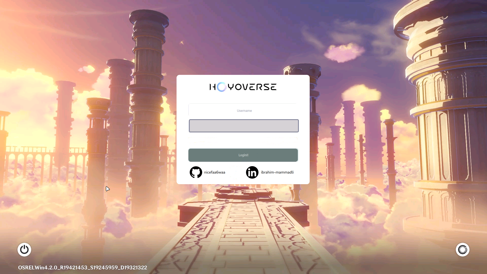

# Genshin Sddm Theme

An animated genshin sddm-theme, comes with animated background
implemented changing backgrounds for the time of day.With every login-session,new wallpaper
will be shown based on the time on your OS. 


## Features (71.87% Completed)

You can change almost all the colors within the 'theme.conf' file.More color options will be added in the future

<details>
  <summary><b>✔️Animated Background (2/2)</b></summary>
    
- [x] Uncompressed Videos
    - [x] Morning Background
    - [x] Sunlight Backround
    - [x] Night Background
- [x] Compressed Videos
    - [x] Morning Background
    - [x] Sunlight Background
    - [x] Night Background
</details>


<details>
  <summary>✔️<b>Login Menu (4/4)</b></summary>

- [x] Login Background
- [x] Username Area
- [x] Password Area
- [x] Github and Linkedin Credits
</details>


<details>
   <summary>✔️<b>Power Menu (2/2)</b></summary>
    
- [x] Mouse Area
- [x] Pop-Up Menu
   - [x] Shutdown
   - [x] Restart
   - [x] Sleep
</details>
      
<details>
   <summary>✔️<b>Session Menu (2/2)</b></summary>
    
- [x] Mouse Area
- [x] Pop Up Menu
   - [x] Ability to choose session
</details>
      
<details>
<summary><b>⚙️Date&Time Menu (0/1)</b></summary>

- [ ] Layout
</details>
      
<details>
   <summary><b>⚙️Door Animation (2/5)</b></summary>

- [x] Function to validate Username and Password
- [x] fragmentShader config for Transparent videos
- [ ] Door Videos
    - [x] Morning Door
    - [x] Sunlight Door
    - [x] Night Door
- [x] Transparent Videos
    - [x] Morning Door
    - [x] Sunlight Door
    - [x] Night Door
- [ ] Encoded Videos

      ❌ Transparent MOV (Didn't work)
      
      ❌ Transparent Webm (Didn't work)
      
      ❌ Custom Function For Png Sequence (Didn't work)
      
     ✔️ Currently fragmentShader config with black background kind of works but looks weird.Will try to find a better solution in the future.
      
    - [ ] Morning Door
    - [ ] Sunlight Door
    - [ ] Night Door

</details>


<details>
    <summary><b>⚙️Loading Animation (0/1)</b></summary>
    
- [ ] Loading Animation
</details>

<details>
    <summary><b>⚙️Variable Animations for different time of the day (1/3)</b></summary>

- [x] Morning Animations
- [ ] Sunlight Animations
- [ ] Night Animations
</details>


❌ ~~<b>Custom Grub and plymouth theme</b>~~ (Maybe Later)


❌ ~~<b>Install Script</b>~~ (Maybe Later)


❌ ~~<b>Custom swaylock and wlogout theme</b>~~ (Maybe Later)
      


## Issues and Contribution

If you would like to contribute to this repo please do so by creating a PR. I am open to suggestions.


## Dependencies

Install sddm(Simple Desktop Display Manager).You also need QT5 which includes Qt Quick Controls 2, Qt Graphical Effects, Qt SVG, Qt Quick Layouts with version 5.11 or new.To do so 


For **Arch** based distros using **pacman**
(Obarun/Artix/Manjaro/KaOS/Chakra etc.)
```bash
sudo pacman -S --needed sddm
qt5‑graphicaleffects
qt5‑quickcontrols2
qt5‑svg
```
For **Debian** based distros using **apt**
(Ubuntu/Kubuntu/Kali/Neon/antiX etc.)
```bash
sudo apt install ‑‑no‑install‑recommends
sddm
qml‑module‑qtquick‑layouts
qml‑module‑qtgraphicaleffects
qml‑module‑qtquick‑controls2
libqt5svg5
```


## Installing and Testing

Follow the steps below to install and test it:

To test it before use you need to install this repo and copy it to your sddm themes folder.


In order to do this:


For Arch based distros:
```bash
cd
git clone https://github.com/nicefaa6waa/genshin-sddm-theme.git
sudo cp -r /genshin-sddm-theme/ /usr/share/sddm/themes/
```
For Debian based distros:
```bash
cd
git clone https://github.com/nicefaa6waa/genshin-sddm-theme.git
sudo cp -r genshin-sddm-theme /usr/share/sddm/themes/
```
After that install and unzip various backgronud videos.Choose the one you like and download as a zip.

(2,3GB for Uncompressed videos.~400mb For compressed ones)


[Google Drive](https://drive.google.com/drive/folders/1Yz2GxV8uvZJM16YSbE2yPRMT58H5o0Bs?usp=drive_link)


Then unzip the downloaded folder to your themes folder.In order to do so:
```bash
For Uncompressed zip
sudo unzip -q -d /usr/share/sddm/themes/genshin-sddm-theme/backgrounds/ ~/Downloads/Uncompressed*.zip
For Compressed zip
sudo unzip -q -d /usr/share/sddm/themes/genshin-sddm-theme/backgrounds/ ~/Downloads/Compressed*.zip
```

I HIGHLY RECOMMEND TESTING FIRST.

There may be some visual bugs on varying distros so before changing your theme test it first with the command.
Now, assuming that you've installed it correctly to test it:

```bash
sddm-greeter --test-mode --theme genshin-sddm-theme
```

## Applying

If you are new and you don't know how to change the SDDM theme, follow these steps:

1. Edit the config file in '/etc/sddm.conf'. If you don't have 'sddm.conf' file, then copy it from '/usr/lib/sddm/default.conf'. If you are on hyprdots, then the config file will be in '/etc/sddm.conf.d/kde_settings.conf'.

    ```bash
    sudo nano /path/to/your/config/file
    ```

2. Look for the following section in the configuration file:

    ```ini
    [Theme]
    Current=
    ```

3. Change your theme to `genshin-sddm-theme`.

## Credits

This is the modified version of [aczw's corner theme](https://github.com/aczw/sddm-theme-corners)
