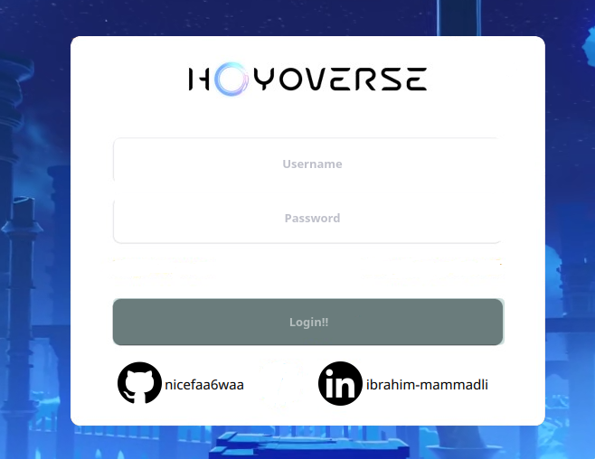
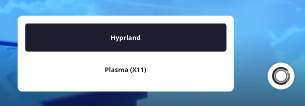
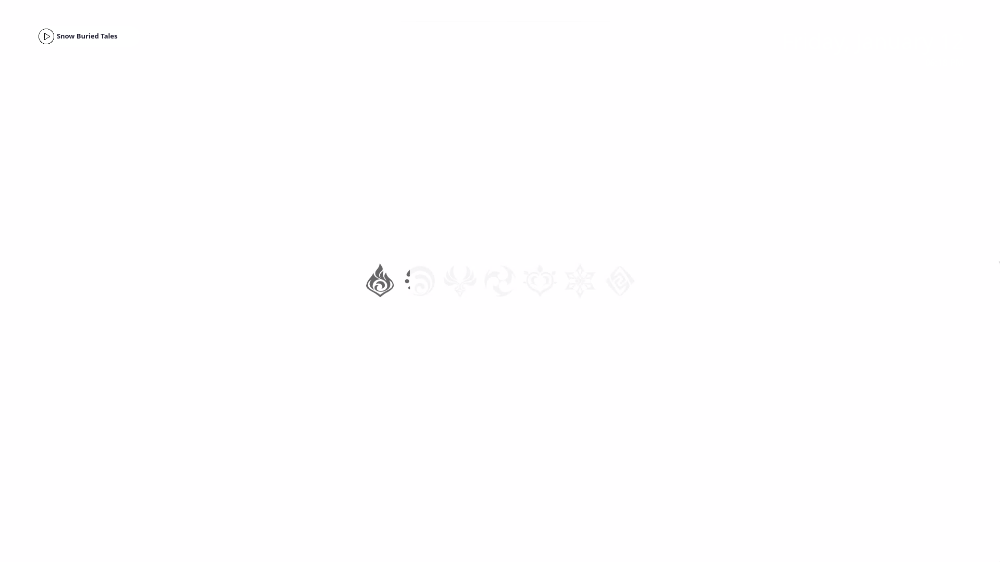

# Genshin Sddm Theme

An animated genshin sddm-theme, comes with animated background
implemented changing backgrounds for the time of day.With every login-session,new wallpaper
will be shown based on the time on your OS. 


## Features and Development (84.75% Completed)


You can change almost all the colors within the 'theme.conf' file.More color options will be added in the future

<details>
  <summary><b>✔️Animated Background (2/2)</b></summary>
    
- [x] Uncompressed Videos
    - [x] Morning Background
    - [x] Sunlight Backround
    - [x] Night Background
- [x] Compressed Videos
    - [x] Morning Background
    - [x] Sunlight Background
    - [x] Night Background


</details>


<details>
  <summary>✔️<b>Login Menu (4/4)</b></summary>

- [x] Login Background
- [x] Username Area
- [x] Password Area
- [x] Github and Linkedin Credits
      


</details>


<details>
   <summary>✔️<b>Power Menu (2/2)</b></summary>
    
- [x] Mouse Area
- [x] Pop-Up Menu
   - [x] Shutdown
   - [x] Restart
   - [x] Sleep
  

</details>
      
<details>
   <summary>✔️<b>Session Menu (2/2)</b></summary>
    
- [x] Mouse Area
- [x] Pop Up Menu
   - [x] Ability to choose session
         
  

</details>
      
<details>
<summary><b>✔️Date&Time Menu (1/1)</b></summary>

- [x] Layout
</details>
      
<details>
   <summary>✔️<b>Door Animation (5/5)</b></summary>

- [x] Function to validate Username and Password
- [x] fragmentShader config for Transparent videos
- [x] Door Videos
    - [x] Morning Door
    - [x] Sunlight Door
    - [x] Night Door
- [x] Transparent Videos
    - [x] Morning Door
    - [x] Sunlight Door
    - [x] Night Door
- [x] Encoded Videos

      ❌ Transparent MOV (Didn't work)
      
      ❌ Transparent Webm (Didn't work)
      
      ❌ Custom Function For Png Sequence (Didn't work)
      
     ✔️ Currently fragmentShader config with black background kind of works but looks weird.Will try to find a better solution in the future.
      
    - [x] Morning Door
    - [x] Sunlight Door
    - [x] Night Door
   

</details>


<details>
    <summary>✔️<b>Loading Animation (1/1)</b></summary>
  
- [x] 1:1 Replica of Genshins Loading animation when you succesfully log in.
      

</details>

<details>
    <summary>✔️<b>Variable Animations for different time of the day (3/3)</b></summary>


- [x] Morning Animations
- [x] Sunlight Animations
- [x] Night Animations
  
</details>

<details>
  <summary><b>✔️Custom songs and Music Player (2/2)</b></summary>

- [x] List of custom songs
- [x] Music Player on login screen to change the currently playing song

</details>


<details>
    <summary>✔️ <b>Install Script</b> (3/3)</summary>

- [x] Auto-download videos (Some of the videos are uploaded to rep whioe the others are uploaded to Google Drive/Mega/Dropbox.Only Dropbox and Mega are automatic.Will add automatic installation for Google Drive in the future)
- [x] Add Users
- [x] Change current theme
</details>

<details>
   <summary>✔️<b> <b>Windows Version</b> (Finished and published in another repository.Check my profile for more information.) (6/6)</b></summary>
    
- [x] Re-Create whole qml theme in QT 6 Framework
- [x] Re-Create or fix Types and Arguments
- [x] Optimize Variables
- [x] Change os-based settings
- [x] Build Application
- [x] Deploy Build

Currently most features doesn't work or removed for compatibility and transition to qt6.I will try to replace windows locksreen first then add removed features. 

</details>

<details>
    <summary>✔️ <b>Add Custom SFX</b> (2/2)</summary>

- [X] SFX For Button Click
- [X] SFX For Door Animations


</details>

<details>
    <summary>✔️ <b>SHA-256 Encryption</b> (3/3)</summary>

- [x] Write a custom pure JS code to encrypt password
- [x] New Script to update users
- [x] Update scripts

</details>

<details>
    <summary>⚙️ <b>Custom Grub theme</b> (1/7)</summary>

- [x] Design a custom background image.
- [ ] Customize fonts and colors for the menu items.
- [ ] Add icons for different menu entries.
- [ ] Configure the boot menu layout.
- [ ] Test the theme on a virtual machine.
- [ ] Troubleshoot and fix any display issues.
- [ ] Write a script for automated installation.

</details>

<details>
    <summary>⏸️ <b>Custom Ui for Installer</b> (0/?)(Paused)</summary>

- [ ] Add installer UI with qt6 for better usability and easier installation for new people.


</details>


<details>
    <summary>⏸️ <b>Custom lock theme</b> (0/2)(Paused)</summary>

- [ ] So i will need to create my own lockscreen since swaylock won't work with widgets because of layers 
- [ ] From this point i will mainly work on optimization,layout fixes and lock screen.


</details>


❌ ~~<b>Add AUR compatibility for easier installs on Arch based systems</b>~~ (Maybe Later)


❌ ~~<b>Custom plymouth theme</b>~~ (Maybe Later)


❌ ~~<b>Custom wlogout theme</b>~~ (Maybe Later)
      


## Issues and Contribution

Before creating an issue, please check the Wiki for common issues and their solutions first.If you would like to contribute to this repo, feel free to do so by creating a PR. I am open to suggestions.


## Dependencies


For **Arch** based distros using **pacman**
(Obarun/Artix/Manjaro/KaOS/Chakra etc.)
```bash
sudo pacman -S gst-libav phonon-qt5-gstreamer gst-plugins-base gst-plugins-good gst-plugins-bad gst-plugins-ugly qt5-quickcontrols2 qt5-graphicaleffects qt5-multimedia qt6-base xorg-xrandr nodejs npm --overwrite '*'

```
For **Debian** based distros using **apt**
(Ubuntu/Kali/Neon/antiX etc.Excluding Kubuntu)
```bash
sudo apt-get install gstreamer1.0-libav qml-module-qtmultimedia libqt5multimedia5-plugins qt6-base-dev nodejs npm
```

For **Kubuntu** using **apt**
```bash
sudo apt install gstreamer1.0-libav phonon4qt5-backend-gstreamer gstreamer1.0-plugins-good qml-module-qtquick-controls qml-module-qtgraphicaleffects qml-module-qtmultimedia qt5-default qt6-base nodejs npm
```


## Installing and Testing
Installation just got easier.Just clone this repo then cd into repo and run installer.
Videos will be installed using megatools.
```bash
git clone https://github.com/nicefaa6waa/genshin-sddm-theme.git
cd genshin-sddm-theme
bash install-sddm-theme.sh
```


If you want manual installation:
<details>
<summary><b>⚙️Manual Installation Instructions </b></summary>


Follow the steps below to install and test it:

To test it before use you need to install this repo and copy it to your sddm themes folder.


In order to do this:


For Arch based distros:
```bash
cd
git clone https://github.com/nicefaa6waa/genshin-sddm-theme.git
sudo cp -r genshin-sddm-theme/ /usr/share/sddm/themes/
```
For Debian based distros:
```bash
cd
git clone https://github.com/nicefaa6waa/genshin-sddm-theme.git
sudo cp -r genshin-sddm-theme /usr/share/sddm/themes/
```

[Google Drive](https://drive.google.com/drive/folders/1Yz2GxV8uvZJM16YSbE2yPRMT58H5o0Bs?usp=drive_link)

Then unzip the downloaded folder to your themes folder.In order to do so:
```bash
For Uncompressed zip
sudo unzip -q -d /usr/share/sddm/themes/genshin-sddm-theme/backgrounds/ ~/Downloads/Uncompressed*.zip
For Compressed zip
sudo unzip -q -d /usr/share/sddm/themes/genshin-sddm-theme/backgrounds/ ~/Downloads/Compressed*.zip
```

I HIGHLY RECOMMEND TESTING FIRST.

There may be some visual bugs on varying distros so before changing your theme test it first with the command.
Now, assuming that you've installed it correctly to test it:

```bash
sddm-greeter --test-mode --theme genshin-sddm-theme
```

## Applying

If you are new and you don't know how to change the SDDM theme, follow these steps:

If you are on KDE Plasma you can easily change sddm theme from settings.If you use something else

1. Edit the config file in '/etc/sddm.conf'. If you don't have 'sddm.conf' file, then copy it from '/usr/lib/sddm/default.conf'. If you are on hyprdots, then the config file will be in '/etc/sddm.conf.d/kde_settings.conf'.Furthermore you may have kde_settings.conf in your current active sddm theme.

    ```bash
    sudo nano /path/to/your/config/file
    ```

2. Look for the following section in the configuration file:

    ```ini
    [Theme]
    Current=
    ```

3. Change your theme to `genshin-sddm-theme`.
</details>

## Credits

This is the modified version of [aczw's corner theme](https://github.com/aczw/sddm-theme-corners)


!DISCLAIMER ALL VIDEOS BELONGS TO HOYOVERSE.I DO NOT OWN ANY OF THEM

## Stars

Thank you all!

[](https://starchart.cc/nicefaa6waa/genshin-sddm-theme)

